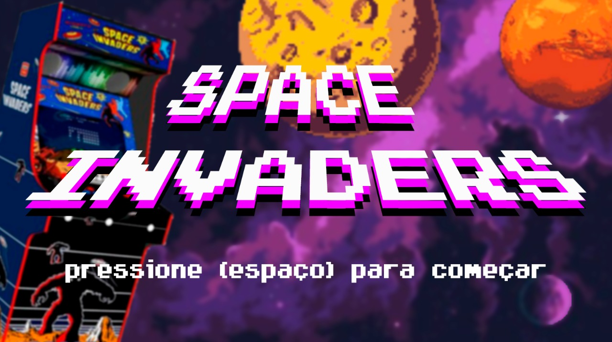
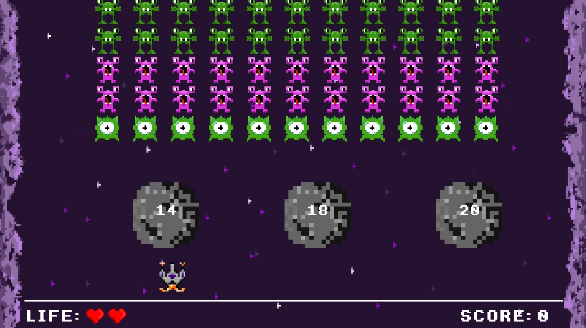
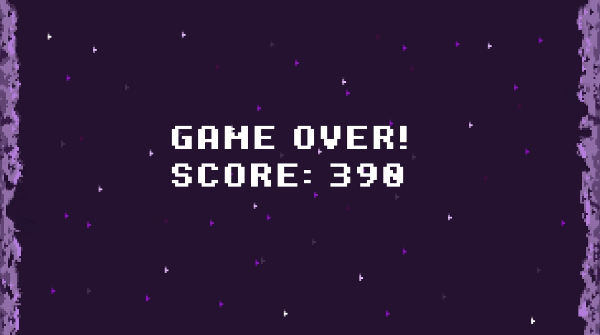

# SpaceInvaders

Este projeto tem como objetivo realizar o trabalho final da disciplina de Programação Orientada a Objetos, cursada na Universidade de São Paulo (USP). Basicamente o projeto consiste no desenvolvimento de um jogo, Space Invaders. O jogo segue as mesmas regras e características que o original, porém com alterações feitas de maneira a deixar o <i>game</i> com meu gosto pessoal.

Toda a parte gráfica foi criada independentemente. Dessa forma, nenhum <i>asset</i> usado foi retirado da internet e, portanto, possuem autoria própria.

## SpaceInvaders
O diretório ```SpaceInvaders``` possui todos os arquivos, sons, imagens, músicas, etc. que o jogo utiliza.

## Manuais
A pasta ```manuais``` contém dois manuais, sendo eles: 
* manual do usuário: explica como o jogo deve ser jogado, quais critérios de vitória/derrota, comandos, entre outras informações de jogabilidade.
* manual do sistema: este manual contém uma breve descrição de como os problemas de programação foram abordados, dizendo quais estratégias foram adotadas em alguns casos. De maneira geral e breve, o código é explicado.

## UML
O UML do projeto foi gerado utilizando o software <b>StarUML</b>, muito útil para geração e mantenção de tais diagramas. Todos arquivos de UML, tanto imagens ```JPEG```, como o arquivo ```mdj``` estão localizados na pasta ```uml```.

## Telas
Abaixo está representada as três telas principais do jogo, sendo elas a tela de menu, tela de <i>gameplay</i> e tela final.

### Menu
A tela de menu é bem simples, somente espera o jogador ficar pronto para começar a <i>gameplay</i>.


### Gameplay
Essa tela é onde ocorre todo o desenvolvimento do <i>game</i>. Nela o jogador utilizará a nave para eliminar os alienígenas presentes, as rochas para se proteger dos tiros dos monstros e marcará seus pontos, acertando os <i>aliens</i> normais como o especial que surge as vezes.


### Final
A tela final, como a tela de menu, também é bem simples. Ela mostra se o jogador ganhou ou perdeu. Ademais, a pontuação do jogo também é mostrada.

